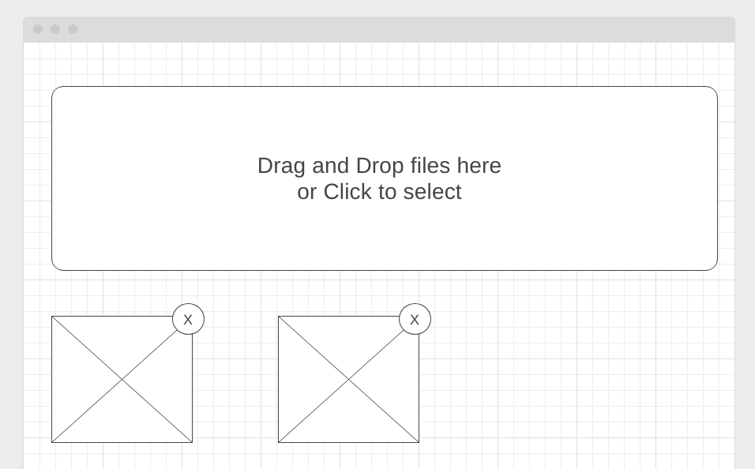

[GitHub Pages](https://lekseff.github.io/Modern-Image-Manager/)

### Modern Image Manager* (задача со звёздочкой)

Важно: эта задача не является обязательной. Её (не)выполнение не влияет на получение зачёта по ДЗ.

#### Легенда

Менеджер картинок, который вы делали в 3-ей лекции нуждается в улучшении, в частности решили сделать две вещи:
1. Предоставить возможность загружать пользователю изображения с его компьютера (а не URL)
1. Совместить форму для Drag and Drop и окошко выбора файлов

#### Описание

Внешний интерфейс должен выглядеть следующим образом:

Схема работы:
1. При переносе изображения (Native DnD) с компьютера пользователя в блок Drag and Drop (т.е. из файлового менеджера переносим файл в окно браузера) должна происходить загрузка файла (если это изображение) и отображение его внизу (превью с крестиком)
1. При клике на блок Drag and Drop должна открываться стандартная форма выбора файлов (как для native `<input type="file">`) после выбора файла также должна происходить загрузка с отображение его внизу (превью с крестиком)

Обратите внимание: нужно, чтобы если пользователь два раза подряд выбрал один и тот же файл (не важно каким способом), этот файл оба раза загрузился и отображался внизу в превью (т.е. должно их быть два).