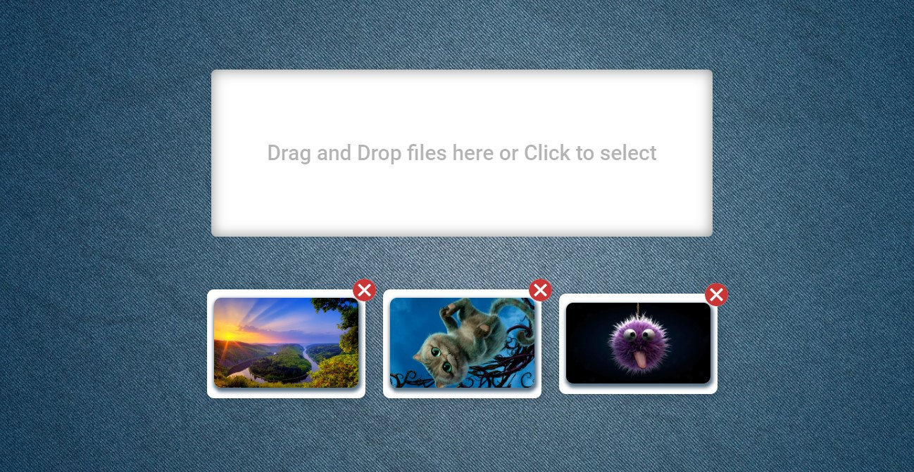

[GitHub Pages](https://lekseff.github.io/Modern-Image-Manager/)

### Modern Image Manager

Принцип работы:
1. При переносе изображения (Native DnD) с компьютера пользователя в блок Drag and Drop (т.е. из файлового менеджера переносим файл в окно браузера) происходит загрузка файла (если это изображение) и отображение его внизу.
2. При клике на блок Drag and Drop открывается стандартная форма выбора файлов. После выбора файла также происходит загрузка с отображение его внизу.
